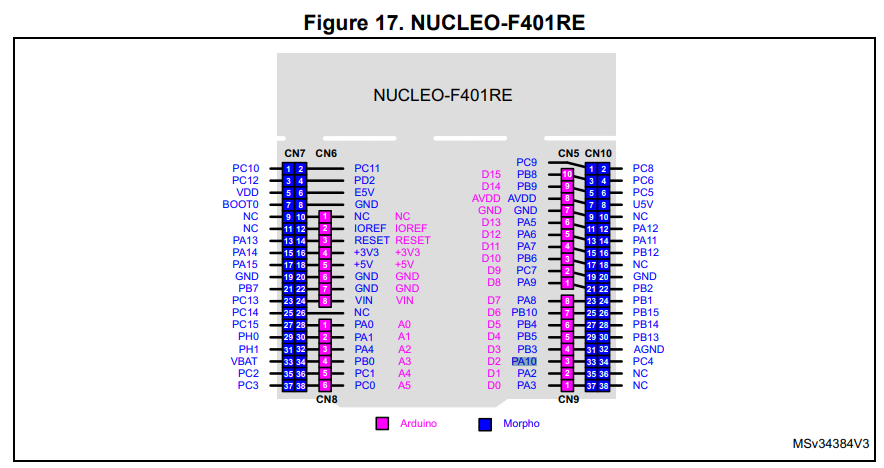
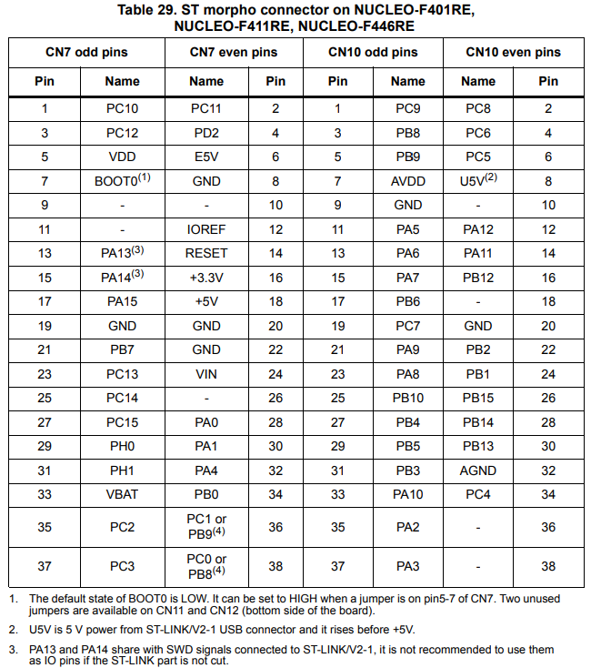
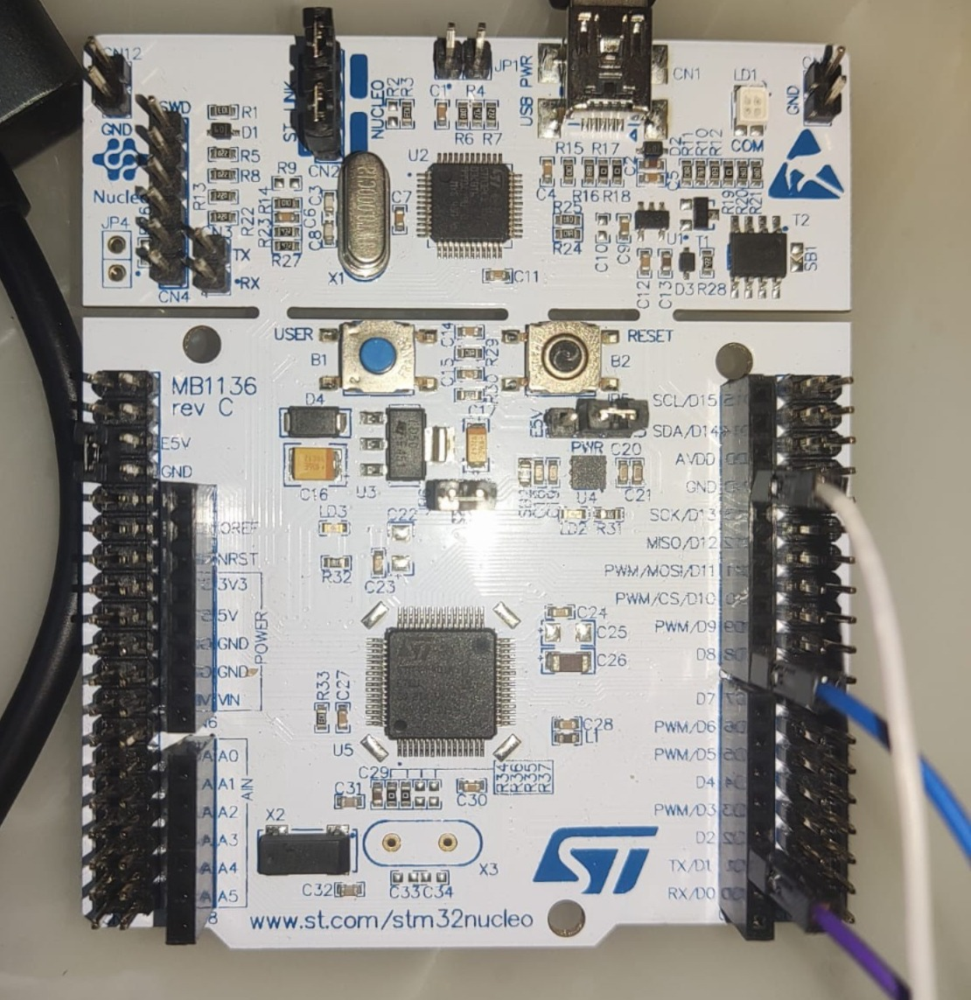

# STM32 UART Bootloader via ESP32


## Overview

ESP32 acts as a standalone programmer for STM32F401RE using the AN3155 USART bootloader protocol. No PC, no ST-LINK, no external tools required. The firmware binary is embedded directly in the ESP32's flash as a C array and written to the STM32 in 256-byte chunks.

---

| Supported Targets | ESP32 | ESP32-C2 | ESP32-C3 | ESP32-C5 | ESP32-C6 | ESP32-C61 | ESP32-H2 | ESP32-H21 | ESP32-H4 | ESP32-P4 | ESP32-S2 | ESP32-S3 |
| ----------------- | ----- | -------- | -------- | -------- | -------- | --------- | -------- | --------- | -------- | -------- | -------- | -------- |


### Hardware Required

The example can be run on any development board, that is based on the Espressif SoC. The board shall be connected to a computer with a single USB cable for flashing and monitoring. The external interface should have 3.3V outputs. You may
use e.g. 3.3V compatible USB-to-Serial dongle.

### Setup the Hardware

Connect the external serial interface to the board as follows.

```
  -----------------------------------------------------------------------------------------
  | Target chip Interface | Kconfig Option     | Default ESP Pin      | External UART Pin |
  | ----------------------|--------------------|----------------------|--------------------
  | Transmit Data (TxD)   | ECHO_TEST_TXD      | GPIO5 (D5)           | RxD               |
  | Receive Data (RxD)    | ECHO_TEST_RXD      | GPIO2 (D2)           | TxD               |
  | Ground                | n/a                | GND                  | GND               |
  -----------------------------------------------------------------------------------------
```
Note: Some GPIOs can not be used with certain chips because they are reserved for internal use. Please refer to UART documentation for selected target.


## Hardware Connections

### Pin Layout

| ESP32 | STM32 Nucleo-F401RE | Notes |
|-------|---------------------|-------|
| GPIO5 (TXD) | PA10 / D2 (USART1 RX) | ESP32 transmits, STM32 receives |
| GPIO2 (RXD) | PA9 / D8 (USART1 TX) | STM32 transmits, ESP32 receives |
| GND | GND | Common ground required |

### BOOT0 Configuration

| Mode | BOOT0 Connection | Behavior |
|------|------------------|----------|
| Normal boot | LOW (default) | Runs user firmware from flash |
| Bootloader | HIGH (CN7 pin 5-7 jumpered) | Runs ST's built-in ROM bootloader |

**Critical:** BOOT0 is only sampled at reset. After changing the jumper, press the RESET button. Use CN7 pin 5 (VDD) and pin 7 (BOOT0) with a jumper wire. Do not short to adjacent pins (E5V on pin 6, GND on pin 8).

### UART Configuration

| Parameter | Value |
|-----------|-------|
| Baud rate | 115200 |
| Data bits | 8 |
| Parity | Even |
| Stop bits | 1 |
| Flow control | None |
| RX pull mode | Pull-down (prevents floating pin noise) |

### Timing Parameters (STM32F401xD/E)

| Parameter | Value (ms) |
|-----------|------------|
| One USART byte send | 0.078125 |
| USART configuration time | 0.00326 |
| USART connection time | 0.15951 |

---

## Why USART1, Not USART2

The Nucleo board's ST-LINK virtual COM port is hardwired to USART2 (PA2/PA3). However, the STM32F401 bootloader listens on:
- **USART1** (PA9/PA10)
- **USART3** (PB10/PB11 or PC10/PC11)

USART2 is **not** a bootloader UART on this chip. Using PA9/PA10 requires external wiring but is the only way to access the ROM bootloader without reworking solder bridges.

---

## Bootloader Protocol (AN3155)

### Command Structure

Every command follows this pattern:
1. Send command byte (e.g., `0x31`)
2. Send complement byte (`cmd ^ 0xFF`)
3. Wait for ACK (`0x79`) or NACK (`0x1F`)

The complement is a single-byte XOR check: `cmd ^ complement = 0xFF`. It detects single-bit errors. It does **not** detect multi-bit errors like a CRC would.

### Supported Commands (Protocol v3.1)

| Command | Byte | Purpose |
|---------|------|---------|
| Get | 0x00 | Read bootloader version and supported commands |
| Get Version | 0x01 | Read protocol version and option bytes |
| Get ID | 0x02 | Read chip ID |
| Read Memory | 0x11 | Read from flash/RAM |
| Go | 0x21 | Jump to user application |
| Write Memory | 0x31 | Write firmware to flash/RAM |
| Extended Erase | 0x44 | Erase flash pages (supports mass erase) |
| Write Protect | 0x63 | Enable write protection |
| Write Unprotect | 0x73 | Disable write protection |

### Auto-Baud Detection

The bootloader uses `0x7F` (binary: `01111111`) for auto-baud detection. This byte pattern has alternating bits with a single dominant start bit, allowing the bootloader to measure the bit timing precisely by detecting the falling edge transitions.

### Write Memory (0x31)

**Constraints:**
- Maximum block size: 256 bytes
- N+1 must be a multiple of 4 (word-aligned writes)
- Flash must be erased before writing

**Sequence per 256-byte chunk:**
```
Send: 0x31 0xCE           → Wait ACK
Send: addr[4] + checksum  → Wait ACK
Send: N + data[N+1] + cksum → Wait ACK
```

Address checksum = XOR of 4 address bytes.
Data checksum = XOR of N and all data bytes.

### Extended Erase (0x44)

**Global mass erase:**
```
Send: 0x44 0xBB        → Wait ACK
Send: 0xFF 0xFF 0x00   → Wait ACK (takes several seconds)
```

Erased flash reads as `0xFF`. NOR flash technology stores charge on floating gates—erasing discharges all gates to logic 1. Writing can only pull bits to 0; erasing is required to return them to 1.

### Go (0x21)

Sends the start address (`0x08000000`) to the bootloader. The bootloader:
1. Reads the first 4 bytes at that address → sets as the initial stack pointer (SP)
2. Reads the next 4 bytes at address+4 → jumps to that address (reset handler / PC)
3. The firmware begins execution

The address sent is `0x08000000`, but the actual jump target is the **reset vector** stored at `0x08000004`.

---

## Memory Map (STM32F401RE)

### Linker Script

```
FLASH (rx) : ORIGIN = 0x08000000, LENGTH = 512K
RAM (xrw)  : ORIGIN = 0x20000000, LENGTH = 96K
```

**`(rx)`** = Read + Execute. Code runs from flash. Data sections (.data, .bss) are copied to RAM at startup.

**`0x00000000` vs `0x08000000`:** The STM32 can remap address `0x00000000` to flash, system memory, or SRAM via boot pin configuration. This determines where the vector table is located at reset. With BOOT0=0 and BOOT1=0, flash at `0x08000000` is aliased to `0x00000000`.

### Vector Table (First 8 Bytes of Firmware)

| Offset | Content | Example |
|--------|---------|---------|
| 0x00 | Initial Stack Pointer (SP) | 0x2000xxxx |
| 0x04 | Reset Handler Address (PC) | 0x0800xxxx |

---

## Firmware Binary (`led.bin`)

- Size: 992 bytes
- Format: Raw binary (no ELF headers, no address information)
- Embedded as: `const uint8_t bare_led_bin[]` in `led_bin.h`
- Total chunks: 3 × 256 bytes + 1 × 224 bytes
- All chunks are word-aligned (992 = 248 × 4)

---

## Key Debugging Lessons

| Problem | Cause | Fix |
|---------|-------|-----|
| Bootloader not responding on COM4 (USART2) | ST-LINK virtual COM port is USART2, not USART1 | Wire ESP32 directly to PA9/PA10 (USART1) |
| Random `0x00` garbage on RX | Floating pin reads noise | `gpio_set_pull_mode(RXD, GPIO_PULLDOWN_ONLY)` |
| NACK (0x1F) on Get command | Bootloader in bad state after partial command | Full power cycle (unplug USB, wait 30s) |
| NACK on Erase Memory (0x43) | Command not supported | Use Extended Erase (0x44) instead |
| Timeout on Go command | Bootloader jumps to firmware and stops responding | This is expected. Remove BOOT0, press RESET |
| `uart_wait_tx_done` breaking sync | Long delay causes bootloader to time out | Remove unnecessary waits between sync and command |
| LD1 blinking red | Short circuit (VDD to E5V or GND via jumper) | Remove jumper, check connections, power cycle |

---

## Source Files

| File | Purpose |
|------|---------|
| `uart_bootloader_main.c` | Main application: sync, commands, flash operations |
| `led_bin.h` | LED blink firmware as embedded C array |
| `led_bin_off.h` | Alternate firmware variant |
| `CMakeLists.txt` | Build configuration (UART + GPIO drivers) |
| `stm32f401xe_flash.ld` | STM32 linker script (for reference) |

---

## Build & Flash

```bash
idf.py build
idf.py -p PORT flash monitor
```

Replace `PORT` with your ESP32's COM port (e.g., `COM3` on Windows, `/dev/ttyUSB0` on Linux).

---

## Pinout








## Sources
[STM32 Nucleo-64 boards (MB1136) - User manual (PDF)](https://www.st.com/resource/en/user_manual/um1724-stm32-nucleo64-boards-mb1136-stmicroelectronics.pdf#page=33)

[Introduction to system memory boot mode on STM32 MCUs (AN2606 - PDF)](https://www.st.com/resource/en/application_note/an2606-introduction-to-system-memory-boot-mode-on-stm32-mcus-stmicroelectronics.pdf)

[How to use USART protocol in bootloader on STM32 MCUs (AN3155 - PDF)](https://www.st.com/resource/en/application_note/an3155-how-to-use-usart-protocol-in-bootloader-on-stm32-mcus-stmicroelectronics.pdf)